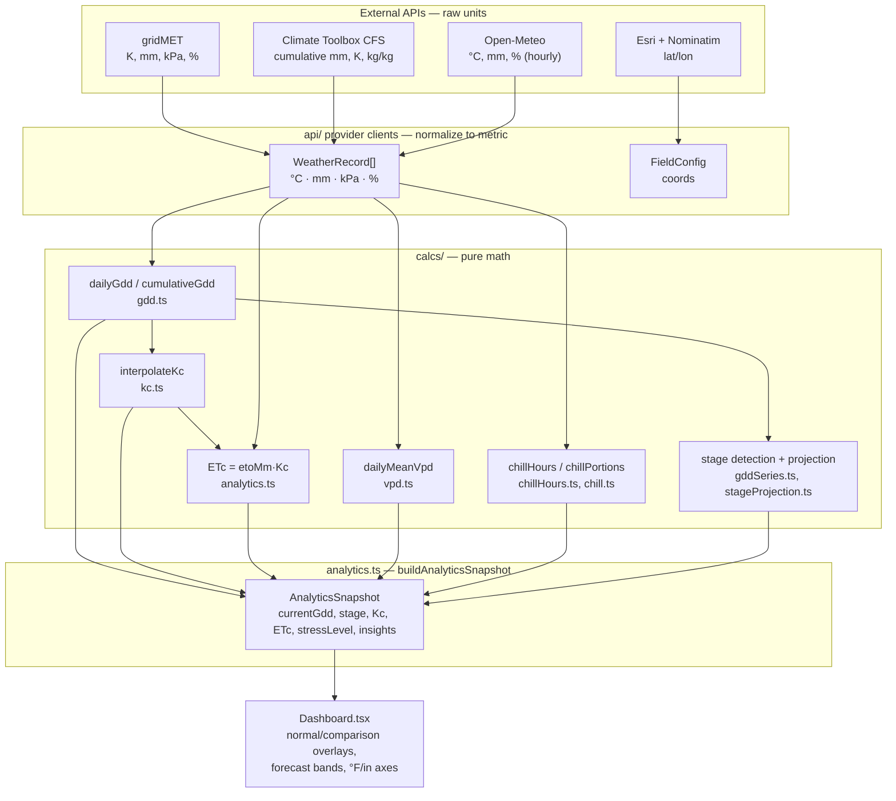

# Data & Metric Flow

How raw units from each external API become the numbers on the dashboard, and
where the data model has gaps. All compute is client-side (`frontend/src`);
fields and settings persist in the browser (`localStorage`).

---

> **Maintainers:** `frontend/src/config/apiRegistry.ts` is the machine-readable
> registry of every service below — upstream URL, proxy path, config/provider
> module, and data-owner contact (e.g. Katherine at the Climate Toolbox). Start
> there when an endpoint moves or you need to know who owns a source.

## Summary — APIs at a glance

### gridMET (primary observed history)
- **URL:** `https://toolbox-webservices.nkn.uidaho.edu/Services/get-netcdf-data/`
- **Data:** max/min temperature · precipitation · reference ET (grass) · vapor
  pressure deficit · max/min relative humidity — daily, 1979→present (~2-day lag)
- **How we use it:** the backbone observed record (Jan 1 → today) behind GDD,
  ETc, VPD, and stress; also the per-year temps + ETo for comparison/normal overlays.

### Climate Toolbox CFSv2 (forecast)
- **URL:** `https://climate-dev.nkn.uidaho.edu/Services/get-cfs-data/`
- **Data:** reference ET · max/min temperature · precipitation · specific
  humidity · vapor pressure deficit — 28-day, 48-member ensemble
- **How we use it:** extends the season forward; forecast GDD/ETc, the P10/P90
  uncertainty band, and projected stage dates.

### Open-Meteo (hourly source)
- **URL:** `https://archive-api.open-meteo.com/v1/archive`
- **Data:** daily min/max temp · precipitation · reference ET; hourly
  temperature · relative humidity · dew point
- **How we use it:** the *only* source of real hourly temps — drives chill-hour
  accounting over the dormant season.

### Esri World Imagery + OSM Nominatim (location, not measurement)
- **URL:** `https://server.arcgisonline.com` (tiles/export) ·
  `https://nominatim.openstreetmap.org` (geocoding)
- **Data:** satellite map tiles · static satellite images · place/address geocoding
- **How we use it:** the field-picker map, field thumbnails, and address → lat/lon
  — the coordinates that key every weather/ET request. Keyless (attribution
  required), so the app needs no API tokens at all.

---

## 1. The pivot point: `WeatherRecord`

Every weather/ET provider normalizes its response into one shared shape,
`WeatherRecord` (`frontend/src/types/domain.ts:65`). This is the single unit of
data that all calculations consume — providers differ only in *which fields they
populate* and *what units they had to convert from*.

| `WeatherRecord` field | Unit (internal) | Meaning |
|---|---|---|
| `tminC` / `tmaxC` | °C | daily min/max air temp |
| `precipMm` | mm | daily precipitation |
| `etoMm` | mm | reference ET (grass) |
| `forecastPetP10Mm` / `P90Mm` | mm | forecast ET uncertainty band |
| `rhMin` / `rhMax` | % | daily relative humidity range |
| `tdewC` | °C | dew point |
| `vpdKpa` | kPa | vapor pressure deficit |
| `hourlyTempsC` | °C[] | 24 hourly temps (real or reconstructed) |
| `source` | enum | `"historical"` \| `"forecast"` |

**Internal unit convention: metric everywhere** (°C, mm, kPa). Imperial (°F, in)
is applied only at the chart/axis layer in `frontend/src/utils/units.ts`.

---

## 2. Per-API: unit in → normalized field → how used

### Endpoints at a glance

The browser calls a same-origin path; a proxy forwards it to the upstream host.
In dev, Vite strips the `/api/<name>` prefix (`vite.config.ts:18`), so the
upstream path equals the endpoint path below. In prod, Traefik
(`deploy/traefik/dynamic.yml`) does the same routing.

| API | Method | Browser calls (proxy) | Upstream endpoint |
|---|---|---|---|
| gridMET | GET | `/api/gridmet/Services/get-netcdf-data/` | `https://toolbox-webservices.nkn.uidaho.edu/Services/get-netcdf-data/` |
| Climate Toolbox CFS | GET | `/api/climate-toolbox/Services/get-cfs-data/` | `https://climate-dev.nkn.uidaho.edu/Services/get-cfs-data/` |
| Open-Meteo | GET | `/api/open-meteo/v1/archive` | `https://archive-api.open-meteo.com/v1/archive` |
| Esri World Imagery | GET | *(direct, not proxied)* | `https://server.arcgisonline.com/ArcGIS/rest/services/World_Imagery/MapServer/...` |
| OSM Nominatim | GET | *(direct, not proxied)* | `https://nominatim.openstreetmap.org/search` |

### gridMET — observed daily history (primary source)
`config/gridmet.ts`, `api/gridMet.ts`. One HTTP request **per variable**
(netCDF extraction, 12–16 s each), 1979→present, ~2-day lag.

**Endpoint:** `GET /Services/get-netcdf-data/` (via `/api/gridmet`). One GET per
variable; the target file is selected by the `data-path` query param
`PATH_TO_DODS/agg_met_<code>_1979_CurrentYear_CONUS.nc` (`gridmet.ts:37`), with
`lat`/`lon`/`start-date`/`end-date`/`variable` params (`gridMet.ts:133`).

| API variable | API unit | Transform | → `WeatherRecord` |
|---|---|---|---|
| `tmmx` / `tmmn` | **Kelvin** | `K − 273.15` (`toolboxShared.ts:36`) | `tmaxC` / `tminC` |
| `pet` | mm/day | — | `etoMm` |
| `pr` | mm | default 0 if missing | `precipMm` |
| `vpd` | kPa | — | `vpdKpa` |
| `rmax` / `rmin` | % | — | `rhMax` / `rhMin` |

Records without `tmmn`+`tmmx` (+`pet` when required) are dropped
(`gridMet.ts:81`). gridMET silently truncates past its lag, so the real tail is
detected and surfaced as a `data-available-through:` quality flag
(`gridMet.ts:104`).

### Climate Toolbox CFSv2 — 28-day forecast
`config/climate.ts`, `api/climate.ts`. 48-member ensemble, `calc-mode=all`.
Reduced to daily medians before it becomes forecast `WeatherRecord`s.

**Endpoint:** `GET /Services/get-cfs-data/` (via `/api/climate-toolbox`), 28-day
horizon (`climate.ts:8`).

| API variable | API unit | Transform | → field |
|---|---|---|---|
| `pet` | mm, **cumulative** | de-accumulate `v[i]−v[i−1]` (`climate.ts:57`), then P50 median + P10/P90 (`toolboxShared.ts:40`) | `etoMm`, `forecastPetP10Mm/P90Mm` |
| `tmmx`/`tmmn` | **Kelvin** | K→°C, median | `tmaxC`/`tminC` |
| `pr` | mm, **cumulative** | de-accumulate, median | `precipMm` |
| `sph` (specific humidity) | kg/kg | → RH via `e = q·P/(0.622+0.378q)`, `RH=100·e/es` (`climate.ts:127`); → dew point by inverting Tetens (`:139`) | `rhMin/rhMax`, `tdewC` |
| `vpd` | kPa | median | `vpdKpa` |
| *(derived)* | — | sine diurnal curve from tmin/tmax (`climate.ts:151`) | `hourlyTempsC` |

### Open-Meteo — historical archive (hourly source)
`config/openMeteo.ts`, `api/openMeteo.ts`. Requested already in metric
(`temperature_unit=celsius`, `precipitation_unit=mm`). Kept mainly because it is
the **only source of *real* hourly temps** for chill accounting.

**Endpoint:** `GET /v1/archive` (via `/api/open-meteo`), with `daily=` and
`hourly=` variable lists as query params (`openMeteo.ts:100`).

| API variable | API unit | Transform | → field |
|---|---|---|---|
| `temperature_2m_min/max` | °C | — | `tminC`/`tmaxC` |
| `precipitation_sum` | mm | — | `precipMm` |
| `et0_fao_evapotranspiration` | mm | — | `etoMm` |
| hourly `temperature_2m` | °C | bucket by day | `hourlyTempsC` |
| hourly `relative_humidity_2m` | % | daily min/max (`openMeteo.ts:90`) | `rhMin`/`rhMax` |
| hourly `dew_point_2m` | °C | daily average (`:81`) | `tdewC` |

### Esri World Imagery + OSM Nominatim — location, not measurement
`config/map.ts`. Direct (not proxied), keyless. Three distinct endpoints:

- **Raster tiles** — MapLibre GL renders
  `…/World_Imagery/MapServer/tile/{z}/{y}/{x}` (`FieldSetupMap.tsx`).
- **Static thumbnails** — `GET …/World_Imagery/MapServer/export?bbox=…&f=image`
  as an ``, with the pin overlaid in CSS (`FieldMapThumbnail.tsx`).
- **Geocoding** — `GET https://nominatim.openstreetmap.org/search` on Enter
  (`LocationSearch.tsx`); the usage policy forbids per-keystroke autocomplete.

Feeds `FieldConfig.lat/lon`, which key every weather/ET request. Note:
`elevationFt` is hardcoded `0` — never fetched.

---

## 3. Metric flow: API → normalize → calc → chart

### Worked example — GDD → stage → ETc (`calcs/analytics.ts:25`)

For each day in the window `record.date >= field.stageStartDate` (biofix):

1. **GDD** = `max(0, (min(Tmax,Tupper) + max(Tmin,Tbase))/2 − Tbase)` — double
   capped. Running sum → `cumulativeGdd`.
2. **Season progress** = `cumulativeGdd / (final stage's GDD threshold)`.
3. **Kc** = piecewise-linear interpolation of the crop's Kc curve at that
   progress.
4. **ETc** = `record.etoMm × Kc` — the FAO-56 single-coefficient estimate.
5. **Stage** = highest threshold whose GDD ≤ current cumulative; **next stage** =
   first threshold above it; unreached stages are **projected forward** using the
   climatological "normal" daily GDD by calendar day (cap 400 days,
   `stageProjection.ts:56`).
6. **VPD** feeds `stressLevel` (`≥ highVpdKpa+0.5` → high).

Per-field overrides (`gddBaseTempC`, `gddUpperTempC`, `stageThresholds`) replace
the crop defaults before any of this runs (`analytics.ts:18`).

---

## 4. Gaps & data issues

### A. Two live crop-parameter datasets, blended at runtime ⚠️
`data/cropMetrics.ts` and `data/crops.ts` hold *different* values for the same
crop (e.g. cotton Tbase 12 vs 15.6, tomato 8/33 vs 10/30). At runtime
`Dashboard.tsx:277` builds `metricCrop` = the `crops.ts` profile **with Tbase,
Tupper, and stages overridden by `cropMetrics.ts`**. So the *GDD number and stage
thresholds are internally consistent* (both from `cropMetrics.ts`), but `crops.ts`
still supplies the **Kc curve, stress thresholds, and chill-portion requirement**
— fields authored against the *other* dataset's GDD scale. See §5.C for the
concrete Kc-timing consequence. The `crops.ts` `stages`/`tBaseC`/`tUpperC` are
effectively dead. This should be unified to one source of truth.

### B. Stored-but-unused irrigation model ⚠️
`FieldConfig`/`CropProfile` persist `madFraction`, `tawMmPerM`, `rootDepthM`,
and `irrigationEfficiency` — but **no soil-water-balance, depletion, MAD, or
irrigation-scheduling calculation consumes them.** The data is collected and
stored; the metric doesn't exist yet.

### C. Defined-but-unused stress thresholds
`stress.frostCriticalC` and `stress.heatCriticalC` (`domain.ts:18`) are set per
crop but read by nothing. Only VPD-based stress is implemented — there is no
frost or heat-stress metric despite the fields existing.

### D. Heuristic / mock computations
- **Chill Portions** (`chill.ts:3`) is a crude daily-mean bucket heuristic, *not*
  the real Utah/Dynamic model it stands in for.
- Many **stage GDD thresholds** are labeled `"placeholder"`/`"provisional"`/
  `"mock"` in `cropMetrics.ts` confidence fields (e.g. all almond post-bloom
  stages). Only tomato and alfalfa GDD are `"source-backed"`.

### E. Reconstructed-vs-real data blur
`hourlyTempsC` is sometimes **real** (Open-Meteo hourly) and sometimes
**synthesized** from a sine curve (forecast/gridMET, `climate.ts:151`). Chill
hours computed from synthesized hours are smooth approximations, not observations
— nothing downstream distinguishes the two.

### F. Silent unit/lag foot-guns
- gridMET **Kelvin** temps: a missed `K−273.15` would look like plausible-but-
  wrong data. The conversion is keyed off the per-variable `kelvin` flag
  (`config/gridmet.ts:12`) — easy to forget when adding a variable.
- CFS `pet`/`pr` are **cumulative**; forgetting to de-accumulate yields
  monotonically rising "daily" values.
- gridMET's ~2-day lag truncation is only caught via the quality flag; consumers
  that ignore it will assume the requested end date returned.

---

---

## 5. Correctness review — *how* we compute & *what type* of data feeds it

Ranked by severity. "Verdict" = whether the current output is wrong, or merely a
fidelity/robustness limitation.

### Bugs — output is or would be wrong

**C.A — Chill Portions run over the wrong window with a phantom offset.**
`estimateChillPortions(weather)` (`analytics.ts:52`) is handed the **growing-season**
merged records (Jan 1 → forecast), not the dormant season, and the accumulator
*starts at 72* (`chill.ts:10`). Chilling is a winter-dormancy quantity; summing it
over spring→summer with a +72 base is non-physical, and since 72 already exceeds
every crop's `chillRequirementPortions` (50–65), the requirement would always read
"met." **Mitigated:** the value is computed but **never rendered** — the chill view
uses the *separate, correct* chill-**hours** path (Open-Meteo dormant-season data,
`useChillSeries`). So this is a latent bug, not a visible one — but it's wired to
fire the moment someone surfaces `snapshot.chillPortions`. *Verdict: wrong (dormant).*

**C.B — Stage GDD thresholds of uncertain unit provenance vs the °C base used.**
The stage thresholds actually driving the dashboard come from `cropMetrics.ts`,
which **self-documents** several crops as `"provisional"`/`"placeholder"` and, for
cotton, *"originally derived from DD60 guidance and need recalibration for Tbase
12C"* (`cropMetrics.ts:288`). DD60 is a **Fahrenheit** degree-day system; °C-based
GDD accumulates ≈1.8× slower, so any threshold still carrying °F provenance will be
reached far too late. Only tomato and alfalfa GDD are `"source-backed"`; almond's
post-bloom stages are all `"placeholder"`. *Verdict: several stage dates are
unreliable by the data's own admission.*

**C.C — Kc timing is decoupled from the stage-GDD scale.**
`ETc = ETo × Kc` where `Kc = interpolateKc(crop, cumulativeGdd / terminalStageGdd)`
(`analytics.ts:28`, `kc.ts:20`). The Kc curve comes from `crops.ts` but the
terminal-stage GDD denominator comes from `cropMetrics.ts` (§4.A). For tomato the
denominator is 1070 (`cropMetrics` Harvest) while the `crops.ts` Kc curve was drawn
for a ~1400-GDD season — so Kc hits end-of-season decline ~24% early, biasing every
modeled ETc value. *Verdict: modeled ETc mistimed whenever the two datasets'
season lengths disagree.*

### Data-type / input-appropriateness issues

**C.D — "Current" stress & VPD are read from a forecast day.**
`stressLevel` and `snapshot.vpdKpa` use the *latest* record (`analytics.ts:51`),
which — with the forecast merged in — is a CFS **ensemble-median** day up to 28
days out, not an observation. The badge labeled "current" atmospheric demand can be
a forecast artifact. *Verdict: right formula, wrong-vintage input.*

**C.E — Measured vs modeled data are silently interchanged.**
- `hourlyTempsC` is *real* from Open-Meteo but *sine-reconstructed* for
  gridMET/forecast (`chillHours.ts:27`, `climate.ts:151`); chill hours from
  synthesized hours are smooth estimates nothing flags as modeled.

**C.F — Humidity/VPD estimates assume sea-level pressure.**
The specific-humidity→RH/dewpoint conversions hard-code `P = 101.3 kPa`
(`climate.ts:128`) because `elevationFt` is hard-coded `0` (never fetched). Biases
RH/VPD upward at elevation. *Verdict: small bias, grows with elevation.*

**C.G — No supply side: precipitation & soil water are collected but unused.**
`precipMm` is fetched from every provider, and `tawMmPerM`/
`madFraction`/`rootDepthM`/`irrigationEfficiency` are stored per field — but **no
water-balance, depletion, or MAD calc consumes them** (`appliedWaterMm` is always
`[]`, `computations.ts:37`). The app shows ET *demand* with no rainfall/irrigation
offset. *Verdict: not a miscalculation — a missing calculation that makes ETc
unusable as an irrigation signal on its own.*

### Methodology caveats (defensible, worth knowing)

- **C.H — "Normal" is a 5-year mean, not a climatological normal.** Baseline =
  `currentYear-5 … currentYear-1` (`Dashboard.tsx:192`); gridMET has data to 1979,
  so 5 years is a choice. Stage projections inherit that noise
  (`stageProjection.ts` walks the 5-yr normal daily-GDD map).
- **C.I — GDD uses simple-average horizontal double-cutoff only.** `cropMetrics.ts`
  advertises `method: "single-sine"` but only simple-average is implemented
  (`gdd.ts:3`); expect ~5–10% divergence from UC/IPM single-sine models.
- **C.J — Forecast seam.** gridMET's ~2-day lag ends history near `today-2` while
  the forecast starts at `today`; the merge (`weather.ts:18`) can leave a 1–2 day
  gap or, on overlap, briefly label a forecast day `"historical"`.

### What is actually solid
Kelvin→°C conversion; FAO-56 VPD pairing (RHmax·Tmin / RHmin·Tmax, `vpd.ts:19`);
consistent use of **grass reference ETo** across gridMET/CFS so `Kc×ETo` is
dimensionally sound; cumulative-forecast de-accumulation (`climate.ts:57`); the
chill-**hours** path (correct dormant window + real hourly temps); and the GDD
double-cutoff itself is a recognized method.

---

*Generated exploration — see `frontend/src/api/` (providers), `frontend/src/calcs/`
(math), `frontend/src/data/` (crop params), and `Dashboard.tsx` (charts).*
